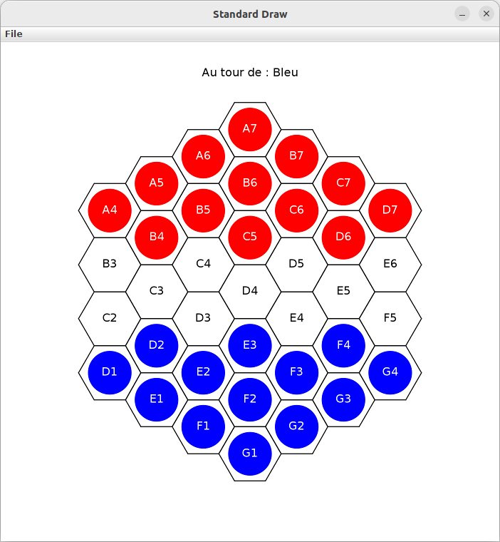

# StuckWin
StuckWin is a mini-game where the goal is to get stuck. The first one to stop playing wins!


## Instructions for use
To play the game, you first need to download the archive and compile all .java files.
```bash
javac *.java
```

To run StuckWin, here is a small documentation :

### To get help :
```bash
java StuckWin --help
```
```java
StuckWin Game
java StuckWin [gameMode] [csvFile] :
	-> [gameMode] // (1: Terminal, 2: Graphical, 3: CSV File Playing, default: Graphical)
	-> [csvFile] // (if gameMode = 3) // Trace to play in 'StuckWin_XX.csv' format.
```

### Play with terminal Interface
```bash
java StuckWin 1
```
Your entire game will be saved in a trace file named "StuckWin_XX.txt". To find the exact name of the file corresponding to your current game, refer to what the terminal tells you.

### Play with graphical Interface (default)
```bash
java StuckWin 2
```
Your entire game will be saved in a trace file named "StuckWin_XX.txt". To find the exact name of the file corresponding to your current game, refer to what the terminal tells you.

### Play traces
StuckWin gives you the possibility to replay your old games, just bring him the .csv trace file.
```bash
java StuckWin 3 <path/filename>
```
